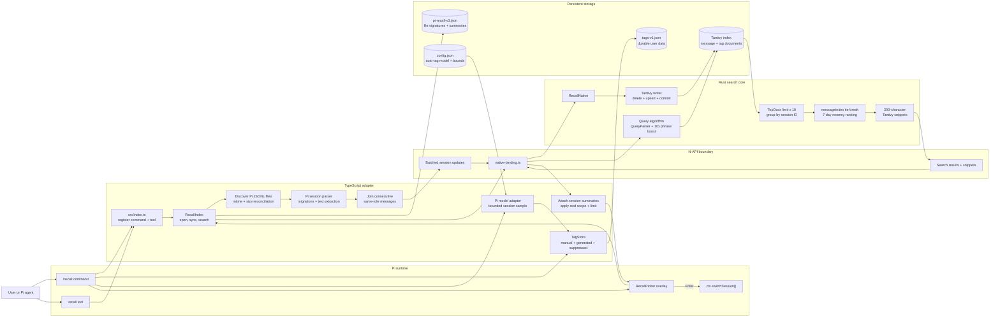

# Architecture

## Design goals

`pi-recall` keeps Pi integration in TypeScript and search-sensitive work in Rust. The design targets
fast local startup, incremental indexing, useful excerpts, deterministic lexical ranking, and direct
session switching without a helper process or server.

## Search model

| Behavior | Implementation |
|---|---|
| Engine | Tantivy 0.22 through Rust N-API |
| Index unit | One normalized Pi message, plus one metadata document per tagged session |
| Same-role messages | Joined before indexing |
| Search fields | `content` and 4x-boosted `tag_text` |
| Exact tags | `#tag` session filter; multiple tags use AND |
| Base query | Tantivy `QueryParser` |
| Multi-token phrase | `PhraseQuery`, 10x boost, OR base |
| Candidate window | `limit * 10` message documents |
| Group key | Session ID |
| Matched-message tie-break | `message_index * 0.01` |
| Session recency | `1 + exp(-age / 7 days)` |
| Snippets | Tantivy, 200 characters |
| Picker limit | 50 sessions |
| Cwd/tag scope | TypeScript derives allowed session IDs; Rust applies a `TermSetQuery` |

Plain multi-word queries use OR semantics, message recency affects which excerpt represents a
session, and the final sort uses the selected message's raw Tantivy score multiplied by session
recency.

Hashtags are parsed before the native call. A tag-only query is resolved directly from the durable
tag store and sorted by session recency. For a mixed query, TypeScript derives the session IDs that
contain every requested hashtag; Rust intersects that set with the remaining lexical query using a
Tantivy `TermSetQuery`. Current-folder scope uses the same mechanism. Irrelevant sessions are removed
before `TopDocs`, avoiding both wasted scoring work and post-filter under-filling.

## Data flow



The extension factory only registers commands and tools. Index opening, discovery, and reconciliation
are deferred until Recall is first used.

## Where TypeScript and Rust connect

There is no subprocess or local server. Rust is compiled as a dynamic library and loaded directly
into the same Pi process as the TypeScript extension:

1. [`native/Cargo.toml`](../native/Cargo.toml) declares `crate-type = ["cdylib"]`, producing a native
   dynamic library.
2. `#[napi]` annotations in [`native/src/lib.rs`](../native/src/lib.rs) export the Rust
   `RecallNative` class through Node-API. Node-API is a stable C ABI understood by both Node and Bun.
3. [`scripts/build-native.mjs`](../scripts/build-native.mjs) runs the release Cargo build and
   atomically replaces the versioned `native/pi-recall-native-v2.node`, allowing an already-running
   Pi process to keep its previous mapped binary safely. Changing the path with the native ABI also
   bypasses Node's native-module cache during `/reload`. The `.node` suffix tells the JavaScript
   runtime that this is a native addon rather than JavaScript.
4. [`src/native-binding.ts`](../src/native-binding.ts) uses `createRequire(import.meta.url)` to load
   that `.node` file. After loading, TypeScript can construct `new RecallNative(indexPath)` and call
   its methods like an ordinary JavaScript object.
5. The method call crosses Node-API in-process, executes Rust synchronously, and returns to the same
   TypeScript call stack. Tantivy's index stays on disk; only method arguments and results cross the
   language boundary.

At runtime, the effective connection is:

```text
TypeScript method call
    -> Node-API function table
        -> compiled Rust method
            -> Tantivy
        <- Rust return value
    <- JavaScript value
```

The boundary deliberately exposes a small operation set: construct/open, apply session changes,
apply tag changes, reset, count documents, search, and list recent results. TypeScript declares that
surface as `NativeRecallEngine`; Rust exports it as `RecallNative`.

### Index-update payload

The TypeScript coordinator parses only new or changed Pi files, then serializes one batched payload:

```text
NativeChangesInput
  deletePaths: string[]
  upserts:
    - session id, path, cwd, latest timestamp, tags
    - normalized user/assistant messages
      - role, content, timestamp, entryId, messageIndex
```

`RecallIndex` passes the payload as a JSON string to `RecallNative.applyChanges()`. Rust deserializes
it with Serde, performs all deletes and additions through one Tantivy writer, commits, and reloads the
reader. JSON is used here to keep the N-API contract small and explicit; it is paid only for changed
sessions, not for every file on every search.

Tag-only edits use a second compact payload containing session metadata and the current merged tag
set. `RecallNative.applyTagChanges()` deletes only that session's previous tag metadata document and
inserts its replacement, so changing a tag does not require reparsing or rewriting message documents.

### Search-result payload

For a query, TypeScript calls `RecallNative.search(query, limit, allowedSessionIdsJson?)`. Rust applies
the optional exact session constraint, performs the lexical query and ranking algorithm, then returns
bounded JSON results containing session metadata, the selected message index, score, snippet, tags,
and highlight spans. TypeScript does not rescore them. It joins each native result with its cached Pi
`SessionSummary`, defensively reapplies the active constraints, and hands the result to the picker or
agent tool.

This division is the main architectural rule: TypeScript decides **what to index, which exact session
filters apply, and how to present it**, while Rust decides **which lexical documents match and how
they rank**.

## Tag data and model adapter

Tags are intentionally stored outside the cache. `tags-v1.json` is keyed by stable Pi session ID and
keeps three sets: `manualTags`, `autoTags`, and `suppressedTags`. Writes use a temporary file and
atomic rename. Rebuilding Tantivy or deleting cache state never deletes user tags.

Manual tags always win. Generated tags that duplicate a manual tag are discarded, and `/recall
untag` adds the removed value to `suppressedTags` so a later model response cannot silently restore
it. The merged manual/generated set is copied into one boosted Tantivy metadata document per tagged
session.

Auto-tagging remains in TypeScript because Pi already owns model discovery, credentials, provider
adapters, and cancellation. The flow is:

```text
command -> load config -> resolve provider/model from Pi registry
        -> confirmation overlay for batch mode
        -> bounded session sample -> Pi complete() call
        -> validate/normalize 3-10 JSON tags
        -> durable TagStore write -> native tag-document update
```

Batch mode selects only sessions whose merged tag set is empty. The progress overlay exposes an
abort signal to the provider call, and each successful session is persisted immediately, making a
cancelled or partially failed run safe to resume.

## Pi adapter

Pi sessions are parsed with Pi's own `parseSessionEntries()` and migrations. User and assistant text
blocks are retained; thinking, tool calls, tool results, and non-conversation entries are excluded.
Each native document repeats the session ID, path, cwd, and latest-message timestamp as stored
metadata. Pi-only stored fields—role, message timestamp, and entry ID—let the extension format useful
tool output without changing the searchable schema or scoring.

The TypeScript layer owns file discovery, incremental state, deriving exact tag/cwd constraints,
model calls, session reads, and the UI. Rust applies those constraints and owns lexical search scores
and snippets.

## Incremental consistency

Each state entry records millisecond mtime, byte size, and a session summary. On synchronization:

- New or changed files are parsed and replaced in one Tantivy writer commit.
- Changed files are deleted from the index before replacement.
- Deleted source files are removed from both Tantivy and state.
- Unchanged files require metadata checks only.
- Native document count (messages plus tagged-session metadata documents) is compared with state and
  durable tags on startup; a mismatch triggers a clean rebuild.
- State writes use a temporary file and atomic rename.

Deletion reconciliation, millisecond timestamps, version enforcement, atomic state writes, and
corruption recovery protect consistency without modifying search semantics.

## Scope and tradeoffs

- Only Pi sessions are discovered.
- Resume uses `ctx.switchSession()` instead of launching a CLI command.
- The interface is a compact Pi overlay rather than a full transcript-preview application.
- The agent tool returns the selected Tantivy excerpt without applying a second scoring algorithm.
- Current-folder and exact-tag constraints are passed into Tantivy as an allowed-session term set,
  so unrelated sessions cannot consume the bounded candidate window.
- The addon is compiled for the installation platform. Installing from source requires Rust/Cargo;
  published multi-platform binaries can be added later without changing the extension API.

## Why the native boundary is justified

The first implementation used MiniSearch to avoid a native artifact. It was fast, but its BM25+,
AND terms, prefix and typo matching, metadata boosts, grouping model, and 30-day recency curve formed
a different search system.

The Rust engine provides the intended Tantivy query and ranking behavior directly. The N-API boundary
is small—batched session updates and JSON search results—and loads under both Node and Bun. Tantivy
remains on disk and no helper process or daemon is left running.

## Known operational limits

- Two Pi processes can read the Tantivy index concurrently, but simultaneous writers may contend on
  Tantivy's writer lock. A later retry reconciles state.
- Modified sessions are reparsed as a whole instead of tail-indexed.
- All branches stored in a Pi session file are searchable; `read` returns indexed entries in file
  order rather than reconstructing only the current leaf.
- The native index schema is versioned through its directory name. A schema change requires a new
  directory version and rebuild.
